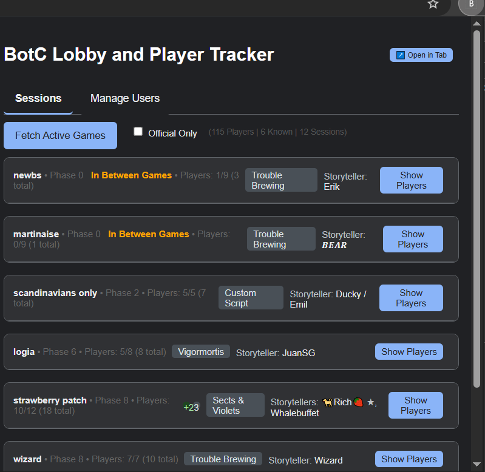
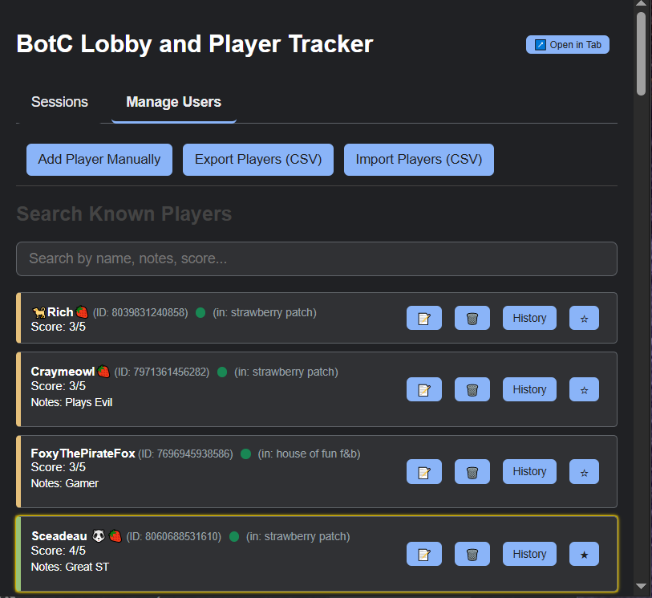
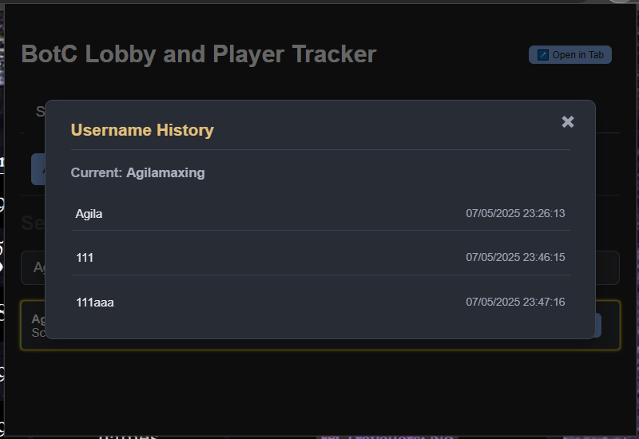

**Current Version (local):** `1.1.1(development)` | **Chrome Web Store Version:** `1.0.4` Pending `1.1.0`
***

# BotC Player Tracker Chrome Extension

This Chrome extension tracks and rates players in Blood on the Clocktower (BotC) games, helping you recognize familiar players across sessions and track username changes.

⚠️ **Important: Back Up Your Player Data!** ⚠️

Your player ratings, notes, and history are stored locally by this extension. If you uninstall the extension, this data will be **permanently deleted** by Chrome.

🛡️ **To keep your data safe or transfer it to another computer:**

*   **ALWAYS use the "Export Players (CSV)" button** (found in the "Manage Users" tab) to save your data to a file **before** uninstalling or if you want a backup. CSV filenames now include a datestamp and user count (e.g., `botc_player_data_YYYYMMDD_Xusers.csv`).
*   You can use the "Import Players (CSV)" button to restore your data from a previously saved CSV file.

Regularly exporting your data is a good habit!

## Table of Contents

- [Installation](#installation)
- [Features](#features)
- [Usage Guidelines](#usage-guidelines)
- [Project Structure](#project-structure)
- [Developer Setup / Loading from Source](#developer-setup--loading-from-source)
- [Release Workflow](#release-workflow)
- [Screenshots](#screenshots)
- [Future Improvements](#future-improvements)
- [Known Issues](#current-status--known-issues)
- [Contributing](#contributing)

## Installation

**1. Install from the Chrome Web Store (Recommended)**

*   The easiest way to install is directly from the Chrome Web Store:
    *   **[BotC Player Tracker on Chrome Web Store](https://chromewebstore.google.com/detail/botc-tracker/ecmkmfkmljmneefknldphpdjlmgpdhkc?authuser=0&hl=en)**
*   Click "Add to Chrome" and the extension will be installed automatically.
*   Pin it to your toolbar for easy access.
*   *Note: The version on the Chrome Web Store might occasionally be behind the latest version on GitHub due to Google's review process.* 

**2. Install from GitHub Release (Manual Load)**

This method allows you to install a specific version from GitHub, which might be newer than the one on the Chrome Web Store.

1.  **Download the latest release:**
    *   Go to the [Releases page](https://github.com/altjerry0/BoTC-Track/releases).
    *   Download the `botc-tracker-vX.Y.Z.zip` file from the desired release.
2.  **Unzip the file:** Extract the contents of the downloaded ZIP file to a folder on your computer. You should see a folder named `botc-extension` (or similar, containing `manifest.json` and an `src` folder).
3.  **Load into Chrome:**
    *   Open Chrome and navigate to `chrome://extensions/`.
    *   Enable **Developer mode** by toggling the switch in the top right corner.
    *   Click on **Load unpacked**.
    *   Select the `botc-extension` folder you unzipped in step 2 (the one containing `manifest.json`).
4.  The extension should now be loaded. Pin it to your toolbar for easy access.

(For developers looking to load directly from source code, see the [Developer Setup / Loading from Source](#developer-setup--loading-from-source) section below.)

## Features

*   **Session Tracking & Player Identification**: Fetches active `botc.app` game sessions and identifies players. Known players are highlighted within session details.
*   **Player Data Management**:
    *   **Rating & Notes**: Assign a 1-5 score and add private text notes to each player.
    *   **Favorite Players**: Mark players as favorites for quick identification.
    *   **Manual Add/Edit**: Manually add new players or edit existing player details (score, notes).
    *   **Refresh Player Name**: Update a player's name directly from `botc.app` via a button on their user card. Old names are saved to history.
*   **Username History**: Tracks changes to player usernames over time, accessible via a history icon.
*   **Comprehensive Online Status**: 
    *   The "Manage Users" tab accurately indicates if a player (including storytellers and spectators) is 'online' by checking `session.usersAll` from fetched game data. Their current game session is also displayed.
    *   For offline players, displays how long ago they were last active (e.g., "5 mins ago", "2 days ago").
*   **Online Favorites Display**: The "Sessions" tab lists favorite players who are currently active in any fetched game sessions.
*   **Background Data Synchronization**: 
    *   Periodically fetches session data from `botc.app` (approx. every 2 minutes if an auth token is present).
    *   Updates players' `lastSeenTimestamp`, `lastSeenSessionId`, and `sessionHistory`.
    *   Detects and records player username changes during background syncs.
*   **Data Import/Export (CSV)**: 
    *   Save all player data (ID, name, score, notes, favorite status, histories) to a CSV file.
    *   Exported filenames include a datestamp and user count (e.g., `botc_player_data_YYYYMMDD_Xusers.csv`).
    *   Import player data from a previously saved CSV file.
*   **Player Search**: Search players in the "Manage Users" tab by current/previous usernames, notes, or score.
*   **Dark Mode**: A user-toggleable dark theme for the popup interface.

## Usage Guidelines

1.  **Initial Setup & Viewing Sessions**:
    *   Navigate to `botc.app` and log in if necessary to ensure the extension can capture an auth token.
    *   Click the extension icon to open the popup.
    *   On the "Sessions" tab, click "Fetch Active Games". Active games will be listed.
    *   Online favorite players will be summarized at the top of the "Sessions" tab.

2.  **Managing Players ("Manage Users" Tab)**:
    *   **View Players**: Lists all players encountered. Online players (from `usersAll` in any fetched session) are indicated.
    *   **Search**: Use the search bar to filter players by name (current or historical), notes, userID, or score.
    *   **Edit Player**: Click the pencil icon (✎) on a player card to modify their score or notes.
    *   **Favorite Player**: Click the star icon (⭐) to toggle a player's favorite status.
    *   **View Username History**: Click the clock icon (🕒) next to a player's name to see their username history.
    *   **Refresh Player Name**: Click the refresh icon (🔄) on a player card to update their current username from `botc.app`.
    *   **Delete Player**: Click the trash can icon (🗑️) to remove a player and their data (confirmation required).
    *   **Add Player Manually**: Click the button with an add icon and "Add" text, then provide the Player ID, Name, Score (1-5), and Notes.

3.  **Importing/Exporting Data ("Manage Users" Tab)**:
    *   **Export**: Click the button with an outbox icon and "Export" text. A CSV file (e.g., `botc_player_data_YYYYMMDD_Xusers.csv`) will be downloaded.
    *   **Import**: Click the button with an inbox icon and "Import" text, select your CSV file. Data will be merged/updated based on player IDs.

## Project Structure

```
BoTC-Track (repository root)
├── .github/
│   └── workflows/
│       └── release.yml      # GitHub Actions workflow for release packaging
├── botc-extension/          # Contains the actual Chrome extension files
│   ├── src/
│   │   ├── background.js        # Background service worker (session fetching, alarms)
│   │   ├── icons/               # Extension icons (icon16.png, icon32.png, etc.)
│   │   └── popup/               # UI and logic for the popup
│   │       ├── popup.html       # HTML structure
│   │       ├── popup.js         # Main popup JavaScript (event handling, tab management)
│   │       ├── popup.css        # Styles
│   │       ├── userManager.js   # Module for player data CRUD, history, search
│   │       ├── sessionManager.js# Module for fetching, processing, displaying session data
│   │       └── csvManager.js    # Module for CSV import/export functionality
│   ├── manifest.json            # Extension configuration and permissions
│   └── rules.json               # DeclarativeNetRequest rules (if used for adblocking/modifying requests)
├── .gitignore
├── CHANGELOG.md
├── README.md                # Main project README (this file)
└── TODO.md
```

## Developer Setup / Loading from Source

These instructions are for developers or users who want to load the extension directly from the source code.

1.  **Clone the repository**: `git clone https://github.com/altjerry0/BoTC-Track.git`
2.  Navigate to the project directory: `cd BoTC-Track`
3.  **Open Chrome** and go to `chrome://extensions/`.
4.  Enable **Developer mode** (top right toggle).
5.  Click **Load unpacked**.
6.  Select the `botc-extension` directory from the cloned project.
7.  The extension should now be loaded. Pin it for easy access.

## Release Workflow

This project uses GitHub Actions to automate the creation of release ZIP files.

1.  **Update Version**: Ensure the `"version"` in `botc-extension/manifest.json` is correct for the new release.
2.  **Update CHANGELOG.md**: Finalize changes for the current version and set the release date.
3.  **Commit Changes**: Commit the updated `manifest.json`, `CHANGELOG.md`, and any other code changes.
    ```bash
    git add botc-extension/manifest.json CHANGELOG.md
    git commit -m "Prepare release vX.Y.Z"
    git push
    ```
4.  **Tag the Release**: Create and push a Git tag matching the version (e.g., `vX.Y.Z`). This triggers the GitHub Action.
    ```bash
    git tag vX.Y.Z
    git push origin vX.Y.Z
    ```
5.  The action will create a draft release on GitHub with the packaged `botc-tracker-vX.Y.Z.zip` file. Edit the release notes and publish.

## Screenshots

*(Note: The following screenshots may be slightly outdated due to recent UI updates, particularly button styles. They will be updated in a future commit.)*

Here's a glimpse of the extension in action:

**Sessions Tab:**


**Manage Users Tab:**


**Username History:**


## Future Improvements

- **Security**: Review and enhance token storage and handling if possible.
- **Error Handling**: More robust error handling and user feedback for API issues or data corruption.
- **Performance**: Optimize data processing, especially for users with very large player lists or session histories.
- **Code Organization**: Continue to refine modularity. Consider TypeScript for improved type safety.
- **UX Improvements**: Refine UI/UX for smoother navigation, clearer loading states, and more intuitive interactions.
- **Testing**: Implement unit and integration tests for key functionalities.

## Current Status & Known Issues

*   **Unique Session Tracking**: The display or calculation of a player's unique session count might need review for accuracy under all conditions.
*   **Data Sync on Multiple Devices**: Data is stored locally per browser. There's no automatic sync between different Chrome instances/profiles.

## Contributing

Feel free to submit issues or pull requests for improvements or bug fixes.
