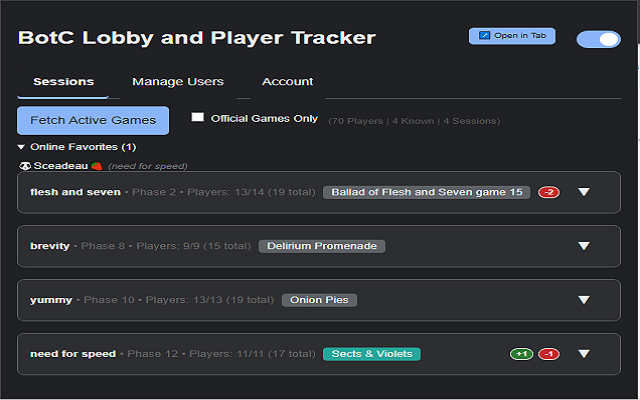
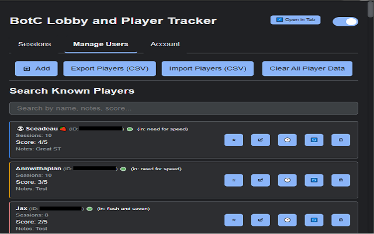
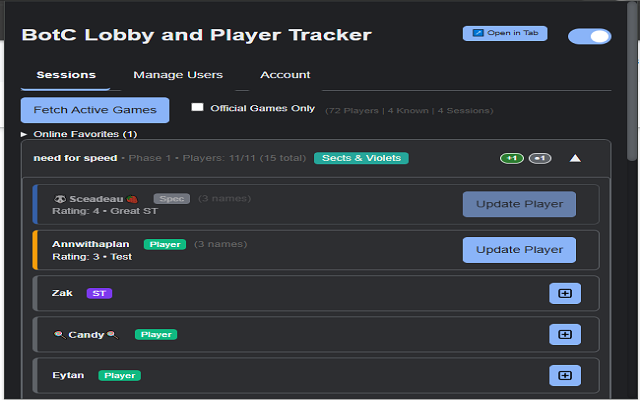

**Current Version:** `1.1.9` | **Chrome Web Store Version:** `1.1.7` (or as per current store status)


# BotC Player Tracker Chrome Extension

This Chrome extension tracks and rates players in Blood on the Clocktower (BotC) games, helping you recognize familiar players across sessions and track username changes. It now features **robust cloud synchronization** of your player data using Google Sign-In and a secure Firebase backend.

> **Key Features in v1.1.9:**
> - **Cloud Data Synchronization**: Securely sync your player ratings, notes, and history across devices using Google Sign-In and Firebase Firestore.
> - **Chrome Web Store Compliant Authentication**: Utilizes the Chrome Identity API and a dedicated [authentication service](./firebase-auth-service/README.md) for secure sign-in without external script loading.
> - **Enhanced Player Role Distinction**: Clear badges for Players, Storytellers, and Spectators.
> - **Comprehensive User Management**: Includes improved player validation, username history, and direct name refresh capabilities.

⚠️ **Important: Back Up Your Player Data!** ⚠️

While cloud sync provides a robust way to keep your data, maintaining local backups via the export feature is still a good practice.
Your player ratings, notes, and history are stored locally by this extension. If you uninstall the extension, this data will be **permanently deleted** by Chrome.

🛡️ **To keep your data safe or transfer it to another computer:**

*   **ALWAYS use the "Export Players (CSV)" button** (found in the "Manage Users" tab) to save your data to a file **before** uninstalling or if you want a backup. CSV filenames now include a datestamp and user count (e.g., `botc_player_data_YYYYMMDD_Xusers.csv`).
*   You can use the "Import Players (CSV)" button to restore your data from a previously saved CSV file.

Regularly exporting your data is a good habit!

## Table of Contents

- [Installation](#installation)
- [Features](#features)
- [Authentication Service](#authentication-service)
- [Usage Guidelines](#usage-guidelines)
- [Project Structure](#project-structure)
- [Developer Setup / Loading from Source](#developer-setup--loading-from-source)
- [Release Workflow](#release-workflow)
- [Screenshots](#screenshots)
- [Future Improvements](#future-improvements)
- [Known Issues](#current-status--known-issues)
- [Contributing](#contributing)

## Installation

**1. Install from the Chrome Web Store (Recommended)**

*   The easiest way to install is directly from the Chrome Web Store:
    *   **[BotC Player Tracker on Chrome Web Store](https://chromewebstore.google.com/detail/botc-tracker/ecmkmfkmljmneefknldphpdjlmgpdhkc?authuser=0&hl=en)**
*   Click "Add to Chrome" and the extension will be installed automatically.
*   Pin it to your toolbar for easy access.
*   *Note: The version on the Chrome Web Store might occasionally be behind the latest version on GitHub due to Google's review process.* 

**2. Install from GitHub Release (Manual Load)**

This method allows you to install a specific version from GitHub, which might be newer than the one on the Chrome Web Store.

1.  **Download the latest release:**
    *   Go to the [Releases page](https://github.com/altjerry0/BoTC-Track/releases).
    *   Download the `botc-tracker-vX.Y.Z.zip` file from the desired release.
2.  **Unzip the file:** Extract the contents of the downloaded ZIP file to a folder on your computer. You should see a folder named `botc-extension` (or similar, containing `manifest.json` and an `src` folder).
3.  **Load into Chrome:**
    *   Open Chrome and navigate to `chrome://extensions/`.
    *   Enable **Developer mode** by toggling the switch in the top right corner.
    *   Click on **Load unpacked**.
    *   Select the `botc-extension` folder you unzipped in step 2 (the one containing `manifest.json`).
4.  The extension should now be loaded. Pin it to your toolbar for easy access.

(For developers looking to load directly from source code, see the [Developer Setup / Loading from Source](#developer-setup--loading-from-source) section below.)

## Features

*   **Cloud Synchronization**: Securely sync your player data (ratings, notes, history, favorites) across multiple devices using Google Sign-In. Data is stored in your private space in Firebase Firestore.
*   **Session Tracking & Player Identification**: Fetches active `botc.app` game sessions. Known players are visually distinguished within session player lists by their rating, and **favorite players are now prominently highlighted** for easy recognition.
*   **Enhanced Session Highlighting (Popup Interface)**:
    *   **Current Tab Game**: Sessions matching the game currently open in your active `botc.app/play` tab are highlighted with a distinct blue glow.
    *   **User's Active Games**: Sessions where your logged-in user is a participant are highlighted with an orange glow and sorted to the top of the list.
    *   **Combined Highlight**: If a session is both the current tab's game AND one you are participating in, it receives a combined visual cue.
    *   These highlights are theme-aware and adjust for dark mode.
*   **Player Score Indicators**: Displays visual indicators (+ for scores 4-5, ● for score 3, - for scores 1-2) in each session header on the "Sessions" tab. These show an aggregate count of known players in that session categorized by their recorded scores, providing a quick summary of the perceived player quality in a game (e.g., "+2 ●1 -1").
*   **Player Data Management**:
    *   **Rating & Notes**: Assign a 1-5 score and add private text notes to each player.
    *   **Favorite Players**: Mark players as favorites for quick identification (highlights them in session lists and the 'Manage Users' tab).
    *   **Manual Add/Edit**: Manually add new players or edit existing player details (score, notes).
    *   **Refresh Player Name**: Update a player's name directly from `botc.app` via a button on their user card. Old names are saved to history.
*   **Username History**: Tracks changes to player usernames over time, accessible via a history icon.
*   **Comprehensive Online Status**: 
    *   The "Manage Users" tab accurately indicates if a player (including storytellers and spectators) is 'online' by checking `session.usersAll` from fetched game data. Their current game session is also displayed.
    *   For offline players, displays how long ago they were last active (e.g., "5 mins ago", "2 days ago").
*   **Online Favorites Display**: The "Sessions" tab lists favorite players who are currently active in any fetched game sessions.
*   **Background Data Synchronization**: 
    *   Periodically fetches session data from `botc.app` (approx. every 2 minutes if an auth token is present).
    *   Updates players' `lastSeenTimestamp`, `lastSeenSessionId`, and `sessionHistory`.
    *   Detects and records player username changes during background syncs.
*   **Data Import/Export (CSV)**: 
    *   Save all player data (ID, name, score, notes, favorite status, histories) to a CSV file.
    *   Exported filenames include a datestamp and user count (e.g., `botc_player_data_YYYYMMDD_Xusers.csv`).
    *   Import player data from a previously saved CSV file.
*   **Player Search**: Search players in the "Manage Users" tab by current/previous usernames, notes, or score.
*   **Dark Mode**: A user-toggleable dark theme for the popup interface.

## Authentication Service

The BotC Player Tracker uses a dedicated backend service for handling authentication securely and in compliance with Chrome Web Store policies. This service manages the exchange of Google OAuth tokens (obtained via the Chrome Identity API) for Firebase custom tokens, allowing the extension to interact with Firebase services without embedding sensitive credentials or requiring broad external script permissions.

For detailed information on the authentication architecture, flow, and setup (if you intend to self-host or contribute to this part of the system), please refer to the [BotC Tracker Firebase Authentication Service README](./firebase-auth-service/README.md).

## Usage Guidelines

1.  **Initial Setup & Viewing Sessions**:
    *   Navigate to `botc.app` and log in if necessary to ensure the extension can capture an auth token.
    *   Click the extension icon to open the popup.
    *   On the "Sessions" tab, click "Fetch Active Games". Active games will be listed.
    *   Online favorite players will be summarized at the top of the "Sessions" tab.

2.  **Managing Players ("Manage Users" Tab)**:
    *   **View Players**: Lists all players encountered. Online players (from `usersAll` in any fetched session) are indicated.
    *   **Search**: Use the search bar to filter players by name (current or historical), notes, userID, or score.
    *   **Edit Player**: Click the pencil icon (✎) on a player card to modify their score or notes.
    *   **Favorite Player**: Click the star icon (⭐) to toggle a player's favorite status.
    *   **View Username History**: Click the clock icon (🕒) next to a player's name to see their username history.
    *   **Refresh Player Name**: Click the refresh icon (🔄) on a player card to update their current username from `botc.app`.
    *   **Delete Player**: Click the trash can icon (🗑️) to remove a player and their data (confirmation required).
    *   **Add Player Manually**: Click the button with an add icon and "Add" text, then provide the Player ID, Name, Score (1-5), and Notes.

3.  **Importing/Exporting Data ("Manage Users" Tab)**:
    *   **Export**: Click the button with an outbox icon and "Export" text. A CSV file (e.g., `botc_player_data_YYYYMMDD_Xusers.csv`) will be downloaded.
    *   **Import**: Click the button with an inbox icon and "Import" text, select your CSV file. Data will be merged/updated based on player IDs.

## Project Structure

```
BoTC-Track (repository root)
├── .github/
│   └── workflows/
│       └── release.yml      # GitHub Actions workflow for release packaging
├── botc-extension/          # Contains the actual Chrome extension files
│   ├── src/
│   │   ├── background.js        # Background service worker (session fetching, alarms)
│   │   ├── icons/               # Extension icons (icon16.png, icon32.png, etc.)
│   │   └── popup/               # UI and logic for the popup
│   │       ├── popup.html       # HTML structure
│   │       ├── popup.js         # Main popup JavaScript (event handling, tab management)
│   │       ├── popup.css        # Styles
│   │       ├── userManager.js   # Module for player data CRUD, history, search
│   │       ├── sessionManager.js# Module for fetching, processing, displaying session data
│   │       ├── csvManager.js    # Module for CSV import/export functionality
│   │       └── modalManager.js  # Module for managing custom modal dialogs
│   ├── manifest.json            # Extension configuration and permissions
│   └── rules.json               # DeclarativeNetRequest rules (if used)
├── firebase-auth-service/     # Backend authentication service (Firebase Cloud Function)
│   └── README.md              # README for the auth service
├── .gitignore
├── CHANGELOG.md
├── README.md                # Main project README (this file)
└── TODO.md
```

## Developer Setup / Loading from Source

### Setting up the Development Environment

1. **Install Node.js and npm** (if not already installed)
   - Download and install from [nodejs.org](https://nodejs.org/)
   - Verify installation with `node -v` and `npm -v`

2. **Install Project Dependencies**
   - Navigate to the project root directory in your terminal
   - Run `npm install` to install all dependencies defined in package.json
   - This will install Firebase, Webpack, and other required packages

3. **Build the Extension**
   - Run `npx webpack --mode=production` (or `npm run build`) to bundle the JavaScript files.
   - This will create bundled files in the `botc-extension/dist/` directory, particularly `background.bundle.js`.
   - *Note: You must rebuild with this command whenever you make changes to files that are part of the Webpack build (e.g., `background.js`, or any files it imports).*

- **Cloud Sync Setup (Firebase)**:
  - To use the cloud sync features during development, you will need to set up your own Firebase project.
  - Configure `firebase-config.js` (if not automatically handled by a bundled config) with your Firebase project details.
  - Ensure your Firebase project has Google Sign-In enabled as an authentication provider and Firestore enabled.
  - You may also need to deploy or emulate the [authentication service](./firebase-auth-service/README.md) if you are not using the production one.

These instructions are for developers or users who want to load the extension directly from the source code.

1.  **Clone the repository**: `git clone https://github.com/altjerry0/BoTC-Track.git`
2.  Navigate to the project directory: `cd BoTC-Track`
3.  **Open Chrome** and go to `chrome://extensions/`.
4.  Enable **Developer mode** (top right toggle).
5.  Click **Load unpacked**.
6.  Select the `botc-extension` directory from the cloned project.
7.  The extension should now be loaded. Pin it for easy access.

## Release Workflow

This project uses GitHub Actions to automate the creation of release ZIP files.

1.  **Update Version**: Ensure the `"version"` in `botc-extension/manifest.json` is correct for the new release.
2.  **Update CHANGELOG.md**: Finalize changes for the current version and set the release date.
3.  **Commit Changes**: Commit the updated `manifest.json`, `CHANGELOG.md`, and any other code changes.
    ```bash
    git add botc-extension/manifest.json CHANGELOG.md
    git commit -m "Prepare release vX.Y.Z"
    git push
    ```
4.  **Tag the Release**: Create and push a Git tag matching the version (e.g., `vX.Y.Z`). This triggers the GitHub Action.
    ```bash
    git tag vX.Y.Z
    git push origin vX.Y.Z
    ```
5.  The action will create a draft release on GitHub with the packaged `botc-tracker-vX.Y.Z.zip` file. Edit the release notes and publish.

## Screenshots

*(Note: The following screenshots may be slightly outdated due to recent UI updates, particularly button styles. They will be updated in a future commit.)*

Here's a glimpse of the extension in action:

**Sessions Tab:**


**Manage Users Tab:**


**Players Dropdown:**


## Future Improvements

- **Security**: Review and enhance token storage and handling if possible.
- **Error Handling**: More robust error handling and user feedback for API issues or data corruption.
- **Performance**: Optimize data processing, especially for users with very large player lists or session histories.
- **Code Organization**: Continue to refine modularity. Consider TypeScript for improved type safety.
- **UX Improvements**: Refine UI/UX for smoother navigation, clearer loading states, and more intuitive interactions.
- **Testing**: Implement unit and integration tests for key functionalities.

## Current Status & Known Issues

*   **Unique Session Tracking**: The display or calculation of a player's unique session count might need review for accuracy under all conditions.
*   **Data Sync on Multiple Devices**: Data is stored locally per browser. There's no automatic sync between different Chrome instances/profiles.

## Contributing

Feel free to submit issues or pull requests for improvements or bug fixes.
