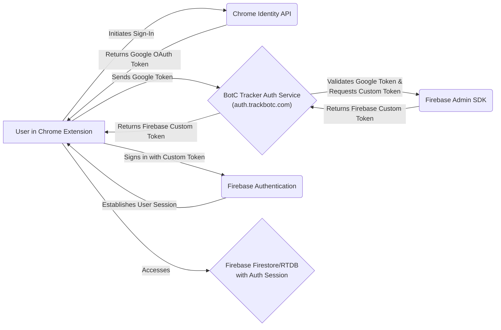

# BotC Tracker Firebase Authentication Service

This service provides a secure way for the BotC Tracker Chrome Extension to authenticate with Firebase without loading external scripts, ensuring Chrome Web Store compliance.

## Overview

This service acts as a middleware between the Chrome Extension and Firebase Authentication. It is built using Node.js (runtime version 22) and Express, hosted as a Firebase Cloud Function (2nd Generation). Its primary responsibilities are:

1.  **Receiving Google Tokens**: Accepts Google OAuth tokens obtained by the Chrome Extension via the Chrome Identity API.
2.  **Token Exchange**: Securely validates the Google token and exchanges it for a Firebase custom token using the Firebase Admin SDK.
3.  **Returning Custom Tokens**: Sends the Firebase custom token back to the extension, which then uses it to authenticate with Firebase services (like Firestore and Firebase Realtime Database if applicable).
4.  **User Profile Management**: Can create or update user profiles in Firebase Authentication based on the information from the Google token.

This approach eliminates the need for external script loading in the extension (like the Firebase JS SDK for auth) and maintains robust security by keeping token exchange server-side.

## Core Architecture Components

1.  **Chrome Identity API (Client-Side)**
    *   Handles Google Sign-In directly within the Chrome extension.
    *   Provides secure OAuth token acquisition without external web flows.
    *   Compliant with Chrome Web Store policies regarding authentication.

2.  **BotC Tracker Auth Service (This Service - `auth.trackbotc.com`)**
    *   A custom Node.js/Express application (Node.js 22) hosted as a Firebase Cloud Function (2nd Generation).
    *   Handles the secure exchange of Google OAuth tokens for Firebase custom tokens.
    *   Validates incoming tokens and interacts with the Firebase Admin SDK.

3.  **Firebase Authentication (Backend)**
    *   Provides the core user authentication system.
    *   Manages user records, UIDs, and sessions once a custom token is used by the client.
    *   Integrates deeply with Firestore security rules to protect user data.

## Authentication Flow



_For a visual representation, see the detailed diagram below._


### Session Management

*   **Google OAuth Token:** Managed and refreshed by the Chrome Identity API automatically.
*   **Firebase Custom Token:** These are short-lived. The Firebase client SDK (used in the extension after initial sign-in with the custom token) handles refreshing the Firebase ID token automatically as long as the user's session is valid.
*   **Storage:** Secure token storage is managed by the Chrome extension, typically using `chrome.storage.local`.

## Setup Instructions

### Local Development

1.  **Install dependencies**
    ```bash
    npm install
    ```

2.  **Create service account key**
    *   Go to [Firebase Console](https://console.firebase.google.com/) > Project Settings > Service Accounts
    *   Generate a new private key for your Firebase project.
    *   Save it as `service-account-key.json` in the root of this service's directory (this file is gitignored).

3.  **Run the service locally** (using Firebase emulators or a local Node server setup)
    ```bash
    npm run dev # Or: firebase emulators:start --only functions
    ```

### Deployment to Firebase Cloud Functions

#### Manual Deployment

1.  Install the Firebase CLI: `npm install -g firebase-tools`
2.  Login to Firebase: `firebase login`
3.  Select your Firebase project: `firebase use <YOUR_PROJECT_ID>`
4.  Deploy the function(s) defined in `index.js`:
    ```bash
    firebase deploy --only functions
    ```

#### Automated Deployment with GitHub Actions

(Ensure this service's code is in a private repository if using service account keys directly in GitHub Actions secrets.)

1.  **Required Secrets for GitHub Actions**:
    *   `FIREBASE_SERVICE_ACCOUNT`: The JSON content of your Firebase service account key.
    *   `FIREBASE_PROJECT_ID`: Your Firebase project ID.

2.  **CI/CD Workflow**: Configure a GitHub Actions workflow (`.github/workflows/deploy.yml`) to deploy on pushes to the main branch or via manual trigger.

## API Endpoints

*   **`POST /auth/exchange-token`**
    *   **Purpose**: Exchanges a Google OAuth token for a Firebase custom token.
    *   **Request body**: `{ "googleToken": "your-google-oauth-token" }`
    *   **Response (Success)**: `{ "token": "firebase-custom-token", "user": { /* Firebase user object */ } }`
    *   **Response (Error)**: `{ "error": "Error message" }` (with appropriate HTTP status code)

*   **`GET /health`**
    *   **Purpose**: Health check endpoint.
    *   **Response**: `{ "status": "ok", "timestamp": "iso-date-string" }`

## Security Features & Considerations

1.  **Token Exchange Security**:
    *   Google OAuth tokens are obtained client-side by the extension but are only sent to this trusted backend service.
    *   The service validates the Google token by calling Google's tokeninfo endpoint or userinfo endpoint before minting a Firebase custom token.
    *   Firebase custom tokens are short-lived and used once by the client to establish a Firebase session.

2.  **Data Isolation**:
    *   Each authenticated user receives a unique Firebase UID.
    *   Firestore security rules *must* be configured to use these UIDs to ensure users can only access their own data.

3.  **Compliance & Best Practices**:
    *   **HTTPS Only**: All communication with this service must be over HTTPS.
    *   **Server-Side Validation**: All token validation and exchange logic resides server-side.
    *   **Secrets Management**: The `service-account-key.json` must be kept secure and never committed to public repositories. Use environment variables or secret management services for deployed functions.
    *   **CORS Configuration**: Implement strict CORS policies in `index.js` to only allow requests from your specific Chrome Extension ID(s) and trusted web origins.
    *   **Rate Limiting**: Consider implementing rate limiting on API endpoints to prevent abuse.
    *   **Input Validation**: Rigorously validate all incoming request payloads.

4.  **Firestore Security Rules**: It's critical to have strong Firestore rules that leverage `request.auth.uid` to protect user data. Example:
    ```
    rules_version = '2';
    service cloud.firestore {
      match /databases/{database}/documents {
        match /userPlayerData/{userId} {
          allow read, write: if request.auth != null && request.auth.uid == userId;
        }
      }
    }
    ```

## Error Handling (Service-Side)

1.  **Token Exchange Failures**:
    *   The service provides clear JSON error responses with appropriate HTTP status codes (e.g., 400 for bad request, 401 for invalid token, 500 for server errors).
    *   Logs detailed error information for debugging (without exposing sensitive data in responses).

2.  **Network Issues / Downstream Service Failures**:
    *   Properly handles errors when communicating with Google's auth endpoints or Firebase Admin SDK services.

## Future Improvements (for this Auth Service)

*   **Enhanced Security**:
    *   Explore options for more advanced abuse detection.
    *   Regularly review and update dependencies.
*   **Observability**:
    *   Improve structured logging for easier monitoring and alerting.

## Development Notes

*   This service must be deployed to the `auth.trackbotc.com` subdomain
*   Ensure all API keys and secrets are properly managed
*   Monitor usage and implement scaling as needed
*   This service is typically deployed to a dedicated URL like `auth.yourdomain.com` (e.g., `auth.trackbotc.com`) and configured in the Chrome extension as the token exchange endpoint.
*   Ensure Firebase Cloud Function (2nd Gen) configurations (region, runtime `nodejs22`, memory, timeout, concurrency) are appropriate for the expected load. These are configured in `firebase.json` and within `index.js` using `setGlobalOptions` and `onRequest` parameters.

## Secure Authentication Flow


## Architecture

```
Chrome Extension                  Auth Service                Firebase
+----------------+              +----------------+          +----------------+
|                |              |                |          |                |
| Chrome         |  Google      | Express Server |          |                |
| Identity API   +------------->+ with Firebase  +--------->+ Firebase Auth  |
|                |   token      | Admin SDK      | Custom   |                |
|                |              |                | token    |                |
+-------+--------+              +----------------+          +-------+--------+
        |                                                           |
        |                                                           |
        v                                                           v
+----------------+                                         +----------------+
|                |                                         |                |
| Extension uses |                                         | Firebase       |
| custom token   +---------------------------------------->+ Firestore      |
| for Firestore  |                                         |                |
|                |                                         |                |
+----------------+                                         +----------------+
